# ciu

This is an R implementation of the Contextual Importance and Utility
(CIU) method for Explainable AI (XAI). CIU was developed by Kary
Främling in his PhD thesis *Learning and Explaining Preferences with
Neural Networks for Multiple Criteria Decision Making*, (written in
French, title *Modélisation et apprentissage des préférences par réseaux
de neurones pour l’aide à la décision multicritère*), available online
for instance here:
<https://tel.archives-ouvertes.fr/tel-00825854/document>. It was
originally implemented in Matlab.

# What is CIU?

**Remark**: It seems like Github Markdown doesn’t show correctly the “{”
and “}” characters in Latex equations, whereas they are shown correctly
in Rstudio. Therefore, in most cases where there is an $i$ shown in
Github, it actually signifies `{i}` and where there is an $I$ it
signifies `{I}`.

CIU is a model-agnostic method for producing outcome explanations of
results of any “black-box” model `y=f(x)`. CIU directly estimates two
elements of explanation by observing the behaviour of the black-box
model (without creating any “surrogate” model `g` of `f(x)`).

**Contextual Importance (CI)** answers the question: *how much can the
result (or the utility of it) change as a function of feature* $i$ or a
set of features $\{i\}$ jointly, in the context $x$?

**Contextual Utility (CU)** answers the question: *how favorable is the
value of feature* $i$ (or a set of features $\{i\}$ jointly) for a good
(high-utility) result, in the context $x$?

CI of one feature or a set of features (jointly) $\{i\}$ compared to a
superset of features $\{I\}$ is defined as

$$
\omega_{j,\{i\},\{I\}}(x)=\frac{umax_{j}(x,\{i\})-umin_{j}(x,\{i\})}{umax_{j}(x,\{I\})-umin_{j}(x,\{I\})},  
$$

where $\{i\} \subseteq \{I\}$ and $\{I\} \subseteq \{1,\dots,n\}$. $x$
is the instance/context to be explained and defines the values of input
features that do not belong to $\{i\}$ or $\{I\}$. In practice, CI is
calculated as:

$$
\omega_{j,\{i\},\{I\}}(x)= \frac{ymax_{j,\{i\}}(x)-ymin_{j,\{i\}}(x)}{ ymax_{j,\{I\}}(x)-ymin_{j,\{I\}}(x)}, 
$$

where $ymin_{j}()$ and $ymax_{j}()$ are the minimal and maximal $y_{j}$
values observed for output $j$.

CU is defined as

$$
CU_{j,\{i\}}(x)=\frac{u_{j}(x)-umin_{j,\{i\}}(x)}{umax_{j,\{i\}}(x)-umin_{j,\{i\}}(x)}. 
$$

When $u_{j}(y_{j})=Ay_{j}+b$, this can be written as:

$$
CU_{j,\{i\}}(x)=\left|\frac{ y_{j}(x)-yumin_{j,\{i\}}(x)}{ymax_{j,\{i\}}(x)-ymin_{j,\{i\}}(x)}\right|, 
$$

where $yumin=ymin$ if $A$ is positive and $yumin=ymax$ if $A$ is
negative.

# Classification Example: Titanic

The Titanic data set is a classification task with classes `yes' or`no’
for the probability of survival. Our Random Forest model achieved 81.1%
classification accuracy on the test set. The studied instance \`Johnny
D’ (an 8-year old boy traveling alone) and model are the same as used in
*Przemyslaw Biecek and Tomasz Burzykowski. Explanatory Model Analysis.
Chapman and Hall/CRC, New York, 2021*.

First load necessary packages:

``` r
# Necessary packages
library(ggplot2)
library(randomForest)
library(caret)
library("DALEX")
```

Train Random Forest model:

``` r
library(ciu)

# Ensure some repeatability.
set.seed(32)

# Some pre-processing
titanic_train <- titanic[,c("survived", "class", "gender", "age", "sibsp", "parch", "fare", "embarked")]
titanic_train$survived <- factor(titanic_train$survived)
titanic_train$gender <- factor(titanic_train$gender)
titanic_train$embarked <- factor(titanic_train$embarked)
titanic_train <- na.omit(titanic_train)

# Train with caret/Random Forest (we don't care about train/test set for this example)
kfoldcv <- caret::trainControl(method="cv", number=10)
model_rf <- caret::train(survived ~ ., titanic_train, method="rf", trControl=kfoldcv)
```

Create instance, CIU object and explain.

``` r
# Create test instance (8-year old boy)
new_passenger <- data.frame(
    class = factor("1st", levels = c("1st", "2nd", "3rd", "deck crew", "engineering crew", "restaurant staff", "victualling crew")),
    gender = factor("male", levels = c("female", "male")),
    age = 8,
    sibsp = 0,
    parch = 0,
    fare = 72,
    embarked = factor("Cherbourg", levels = c("Belfast", "Cherbourg", "Queenstown", "Southampton"))
)

# Create CIU object and get barplot explanation
ciu <- ciu.new(model_rf, survived~., titanic_train)
p <- ciu$ggplot.col.ciu(new_passenger); print(p)
```

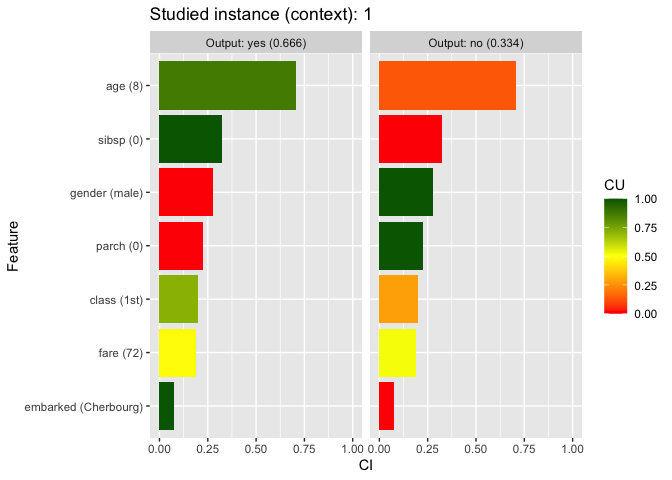<!-- -->

This CIU bar plot explanation “explains” the probability of survival,
which is 63.6%, as well as the probability of non-survival. The bar
lengths show she CI value and the bar color corresponds to the CU value.

The `ciu` package provides numerous visualization possibilities. The
plot above is produced using `ggplot` but there are also
methods/functions that use R’s standard (old) plot functionality. In
practice, it seems like a more clearly “counter-factual” explanation is
more easily understood, as produced by the following code:

``` r
print(ciu$ggplot.col.ciu(new_passenger, output.names = "yes", plot.mode = "overlap"))
```

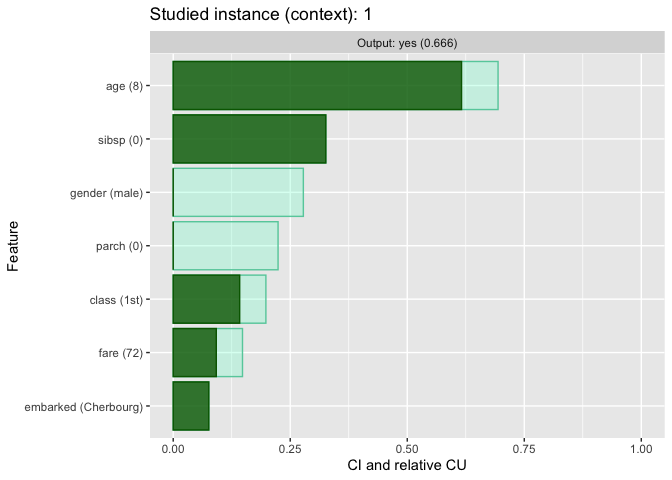<!-- -->

In this plot, the transparent bar shows the CI value, *i.e.* how much
the result could change with a different value than the current one. The
solid part shows how “good” the current value is (CU). This explanation
can be considered counter-factual (what-if) because it *e.g.*shows that
being accompanied by even one parent would significantly increase the
probability of survival (the feature $parch$).

For one input feature, it is easy to see exactly how both CI and CU
values are calculated, as shown by the following call and plot (the red
dot shows the value for instance $x$):

``` r
print(ciu$ggplot.ciu(new_passenger, ind.input = 3, ind.output = 2, illustrate.CIU = TRUE))
```

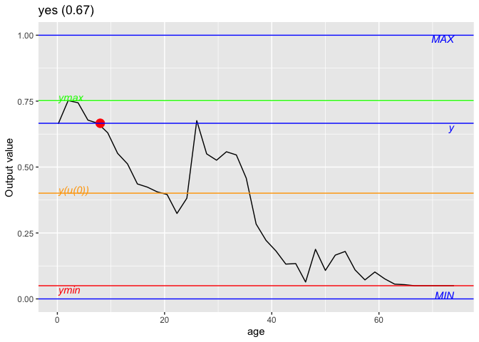<!-- -->

It is also possible to obtain textual explanations:

``` r
cat(ciu$textual(new_passenger, ind.output = 2, use.text.effects = TRUE))
```

    ## The value of output 'yes' for instance '1' is 0.666, which is good (CU=0.666).
    ## Feature 'age' is very important (CI=0.708) and value '8' is very good (CU=0.87).
    ## Feature 'sibsp' is slightly important (CI=0.326) and value '0' is very good (CU=1).
    ## Feature 'gender' is slightly important (CI=0.278) and value 'male' is very bad (CU=0).
    ## Feature 'parch' is slightly important (CI=0.224) and value '0' is very bad (CU=0).
    ## Feature 'class' is not important (CI=0.198) and value '1st' is good (CU=0.717).
    ## Feature 'fare' is not important (CI=0.17) and value '72' is average (CU=0.541).
    ## Feature 'embarked' is not important (CI=0.076) and value 'Cherbourg' is very good (CU=1).

Raw CIU values (for ine feature/input) can be obtained by the “explain”
function:

``` r
ciu$explain(new_passenger, ind.inputs.to.explain = 3)
```

    ##        CI        CU  cmin  cmax outval
    ## no  0.708 0.1299435 0.242 0.950  0.334
    ## yes 0.708 0.8700565 0.050 0.758  0.666

The `meta.explain` method returns an “explanation object” that can also
be passed as a parameter to the plotting/textual functions in order to
evaluate the explanation only once:

``` r
mciu <- ciu$meta.explain(new_passenger)
# Display result values for all inputs
print(mciu$ciuvals)
```

    ## $class
    ##        CI        CU  cmin  cmax outval
    ## no  0.198 0.2828283 0.278 0.476  0.334
    ## yes 0.198 0.7171717 0.524 0.722  0.666
    ## 
    ## $gender
    ##        CI CU  cmin  cmax outval
    ## no  0.278  1 0.056 0.334  0.334
    ## yes 0.278  0 0.666 0.944  0.666
    ## 
    ## $age
    ##        CI        CU  cmin  cmax outval
    ## no  0.708 0.1299435 0.242 0.950  0.334
    ## yes 0.708 0.8700565 0.050 0.758  0.666
    ## 
    ## $sibsp
    ##        CI CU  cmin  cmax outval
    ## no  0.326  0 0.334 0.660  0.334
    ## yes 0.326  1 0.340 0.666  0.666
    ## 
    ## $parch
    ##        CI CU  cmin  cmax outval
    ## no  0.224  1 0.110 0.334  0.334
    ## yes 0.224  0 0.666 0.890  0.666
    ## 
    ## $fare
    ##        CI        CU  cmin  cmax outval
    ## no  0.162 0.4320988 0.264 0.426  0.334
    ## yes 0.162 0.5679012 0.574 0.736  0.666
    ## 
    ## $embarked
    ##        CI CU  cmin  cmax outval
    ## no  0.076  0 0.334 0.410  0.334
    ## yes 0.076  1 0.590 0.666  0.666

``` r
# More practical to use ciu.list.to.frame (out.ind=2 corresponds to "yes" for Titanic):
ciu.list.to.frame(mciu$ciuvals, out.ind = 2)
```

    ##      CI        CU  cmin  cmax outval
    ## 1 0.198 0.7171717 0.524 0.722  0.666
    ## 2 0.278 0.0000000 0.666 0.944  0.666
    ## 3 0.708 0.8700565 0.050 0.758  0.666
    ## 4 0.326 1.0000000 0.340 0.666  0.666
    ## 5 0.224 0.0000000 0.666 0.890  0.666
    ## 6 0.162 0.5679012 0.574 0.736  0.666
    ## 7 0.076 1.0000000 0.590 0.666  0.666

## Contextual influence

The yellow/orange $y(u(0))$ line shown in the plot above is related to
what is called Contextual influence and can be calculated from CI and CU
as follows:

$$
\phi_{j,\{i\},\{I\}}(x)=\omega_{j,\{i\},\{I\}}(x)(CU_{j,\{i\}}(x) - \phi_{0}),
$$

where $\phi_{0}$ is the *baseline/reference* value ($y(u(0))$ in the
plot). For instance, $\phi_{0}=0.5$ signifies using the average utility
value $0.5$ as the baseline, which is the case in the $age$ plot above.
An explanation using Contextual influence can be obtained as follows:

``` r
print(ciu$ggplot.col.ciu(new_passenger, output.names = "yes", use.influence = TRUE) +
        scale_fill_gradient(low="firebrick", high="steelblue") + 
        labs(x ="", y = expression(phi)))
```

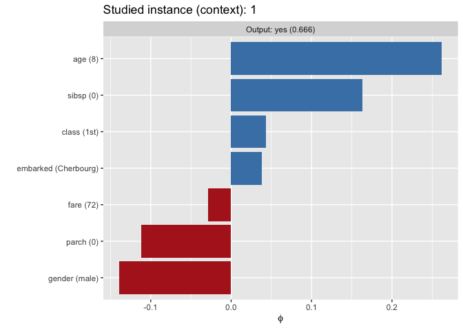<!-- -->

**Remark:** The Equation for Contextual influence is similar to the
definition of Shapley values for linear models, except that the input
value $x_{i}$ is replaced by its utility value(s) $CU_{j,\{i\}}(x)$. In
practice, **all *Additive Feature Attribution (AFA)* methods estimate
influence values, not feature importance. Most state-of-the-art methods
such as *Shapley values*, *LIME*,** are AFA methods.

Influence values give no counter-factual information and are easily
misinterpreted. Below, we create a Shapley value explanation using the
IML package. In that explanation, for instance the close-to-zero Shapley
value for $parch$ gives the impression that it’s a non-important
feature, which is clearly wrong based on the CIU explanation.

``` r
library(iml)
predictor <- Predictor$new(model_rf, data = subset(titanic_train, select=-survived), y = titanic_train[,"survived"])
shapley <- Shapley$new(predictor, x.interest = new_passenger)
d <- shapley$results; d <- d[d$class=='yes',]; d$sign <- d$phi>=0
p <- ggplot(d) + geom_col(aes(x=reorder(feature.value, phi), y=phi, fill=sign)) +
  coord_flip() +
  labs(x ="", y = expression(phi)) + theme(legend.position = "none") +
  scale_fill_manual("legend", values = c("FALSE" = "firebrick", "TRUE" = "steelblue"))
print(p)
```

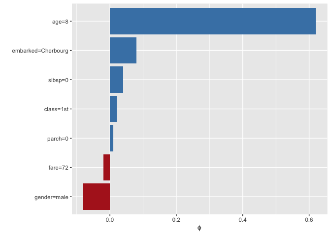<!-- -->

It might be worth mentioning also that the Shapley value explanation has
a much greater variance than the CIU (and Contextual influence)
explanation with same number of samples. This is presumably due to the
fundamental difference between estimating min/max output values for CIU,
compared to estimating a kind of gradient with AFA methods.

# Intermediate Concepts

CIU can use named feature coalitions and structured vocabularies. Such
vocabularies allow explanations at any abstraction level and can make
explanations interactive.

The following code snippet plots the joint effect of features $age$ and
$parch$ for the studied Titanic case (applicable for numeric features).
It therefore shows how the coalition of those two features affects the
output vqlue and how CI and CU can be deduced in the same way as for a
single feature.

``` r
ciu$plot.ciu.3D(new_passenger, c(5,3), ind.output = 2, theta = 50, phi = 10, 
                col = "lightblue", ltheta = 120, shade = 0.75)
```

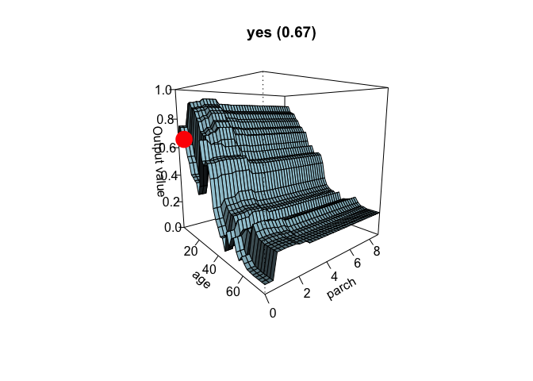<!-- -->

We define a small vocabulary for Titanic as follows:

``` r
wealth<-c(1,6); family<-c(4,5); gender<-c(2); age<-c(3); embarked <- c(7)
Titanic.voc <- list("WEALTH"=wealth, "FAMILY"=family, "Gender"=gender,
                    "Age"=age, "Embarkment port"=embarked)
```

Then we create a new CIU object that uses that vocabulary and get
top-level explanation.

``` r
titanic_ciu <- ciu.new(model_rf, survived~., titanic_train, vocabulary = Titanic.voc)
meta.top <- titanic_ciu$meta.explain(new_passenger[,-8], concepts.to.explain=names(Titanic.voc), n.samples = 1000)
```

First barplot explanation:

``` r
print(titanic_ciu$ggplot.col.ciu(new_passenger[,-8], output.names = "yes", ciu.meta = meta.top, plot.mode = "overlap"))
```

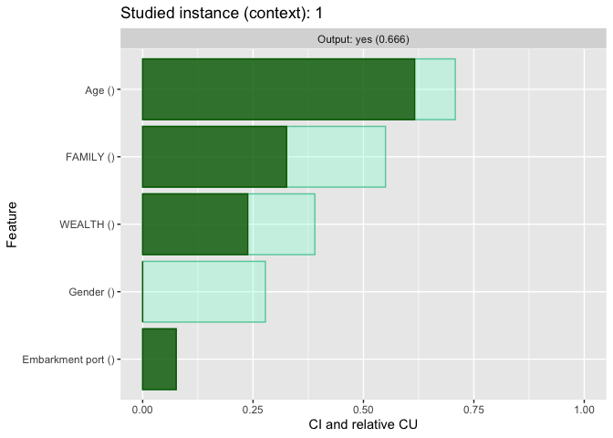<!-- -->

Then explain WEALTH and FAMILY

``` r
print(titanic_ciu$ggplot.col.ciu(new_passenger[,-8], ind.inputs = Titanic.voc$FAMILY, 
                                 output.names = "yes", target.concept = "FAMILY", 
                                 target.ciu = meta.top$ciuvals[["FAMILY"]], n.samples = 100, 
                                 plot.mode = "overlap"))
```

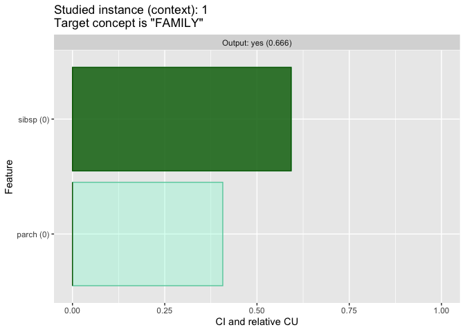<!-- -->

``` r
print(titanic_ciu$ggplot.col.ciu(new_passenger[,-8],ind.inputs = Titanic.voc$WEALTH, 
                                 output.names = "yes", target.concept = "WEALTH", 
                                 target.ciu = meta.top$ciuvals[["WEALTH"]], n.samples = 100,
                                 plot.mode = "overlap"))
```

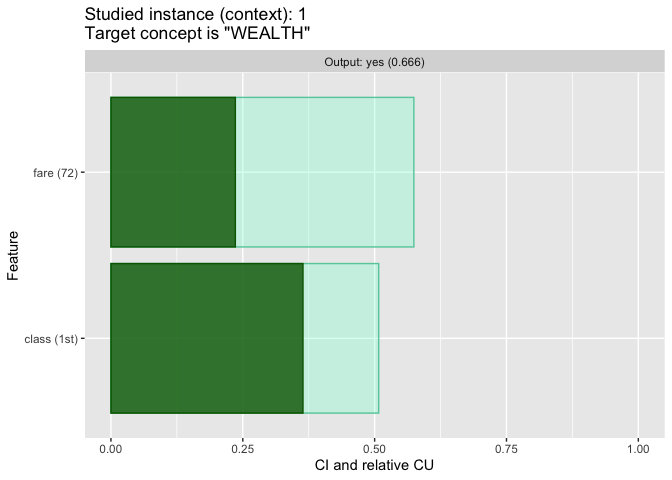<!-- -->

Same thing using textual explanations:

``` r
cat(titanic_ciu$textual(new_passenger[,-8], use.text.effects = TRUE, ind.output = 2, 
                        ciu.meta = meta.top), "\n")
```

    ## The value of output 'yes' for instance '1' is 0.666, which is good (CU=0.666).
    ## Feature 'Age' is very important (CI=0.708) and value '8' is very good (CU=0.87).
    ## Feature 'FAMILY' is important (CI=0.55) and value is average (CU=0.593).
    ## Feature 'WEALTH' is slightly important (CI=0.39) and value is good (CU=0.61).
    ## Feature 'Gender' is slightly important (CI=0.278) and value 'male' is very bad (CU=0).
    ## Feature 'Embarkment port' is not important (CI=0.076) and value 'Cherbourg' is very good (CU=1).
    ## 

``` r
cat(titanic_ciu$textual(new_passenger[,-8], use.text.effects = TRUE, ind.output = 2, 
                        ind.inputs = Titanic.voc$FAMILY, target.concept = "FAMILY", 
                        target.ciu = meta.top$ciuvals[["FAMILY"]], n.samples = 100),  "\n")
```

    ## The value of intermediate concept 'FAMILY' for output 'yes', with instance '1' is average (CU=0.593).
    ## Feature 'sibsp' is important (CI=0.593) and value '0' is very good (CU=1).
    ## Feature 'parch' is important (CI=0.407) and value '0' is very bad (CU=0).
    ## 

``` r
cat(titanic_ciu$textual(new_passenger[,-8], use.text.effects = TRUE, ind.output = 2, 
                        ind.inputs = Titanic.voc$WEALTH, target.concept = "WEALTH", 
                        target.ciu = meta.top$ciuvals[["WEALTH"]], n.samples = 100), "\n")
```

    ## The value of intermediate concept 'WEALTH' for output 'yes', with instance '1' is good (CU=0.61).
    ## Feature 'class' is important (CI=0.508) and value '1st' is good (CU=0.717).
    ## Feature 'fare' is slightly important (CI=0.379) and value '72' is good (CU=0.622).
    ## 

## Ames housing example

Ames housing is a data set about properties in the town Ames in the US.
It contains over 80 features that can be used for learning to estimate
the sales price. The following code imports the data set, does some
pre-processing and trains a Gradient Boosting model:

``` r
library(AmesHousing)
data("AmesHousing")
ames <- data.frame(make_ames())

# Split into train/test data sets
target <- 'Sale_Price'
trainIdx <- createDataPartition(ames[,target], p=0.8, list=FALSE)
trainData = ames[trainIdx,]
testData = ames[-trainIdx,]

# Train (this will take a while!)
kfoldcv <- trainControl(method="cv", number=10)
exec.time <- system.time(
  Ames.gbm <<- train(Sale_Price~., trainData, method="gbm", trControl=kfoldcv))
# Training set performance (remember that prices are high, so RMSE will be high too!)
res <- predict(Ames.gbm, newdata=trainData)
cat(paste("Training set RMSE:", RMSE(trainData$Sale_Price, res), "\n"))
# Test set performance (remember that prices are high, so RMSE will be high too!)
res <- predict(Ames.gbm, newdata=testData)
cat(paste("Test set RMSE:", RMSE(testData$Sale_Price, res)))
```

We create our vocabulary (only two levels this time) and initialize CIU
object:

``` r
Ames.voc <- list(
  "Garage"=c(58,59,60,61,62,63), 
  "Basement"=c(30,31,33,34,35,36,37,38,47,48), 
  "Lot"=c(3,4,7,8,9,10,11), 
  "Access"=c(13,14),
  "House type"=c(1,15,16,21), 
  "House aesthetics"=c(22,23,24,25,26), 
  "House condition"=c(17,18,19,20,27,28),
  "First floor surface"=c(43), 
  "Above ground living area"=which(names(ames)=="Gr_Liv_Area"))
Ames.voc_ciu <- ciu.new(Ames.gbm, Sale_Price~., trainData, vocabulary = Ames.voc)
```

We start with an “explanation” using all 80 basic features, which is not
very readable and overly detailed for “ordinary” humans to understand:

``` r
# We take an expensive house
inst.ind <- which(testData$Sale_Price>500000)[1]
instance <- subset(testData[inst.ind,], select=-Sale_Price)

# Explain
Ames_ciu.meta <- Ames.voc_ciu$meta.explain(instance)
print(Ames.voc_ciu$ggplot.col.ciu(instance, ciu.meta=Ames_ciu.meta, plot.mode = "overlap") +
  labs(title="", x ="", y="CI", fill="CU"))
```

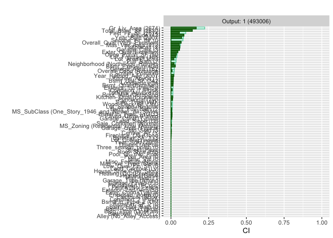<!-- -->

Then the same, using highest-level concepts:

``` r
meta.top <- Ames.voc_ciu$meta.explain(instance, concepts.to.explain=names(Ames.voc), 
                                      n.samples = 1000)
print(Ames.voc_ciu$ggplot.col.ciu(instance, concepts.to.explain=names(Ames.voc), 
                                  plot.mode = "overlap"))
```

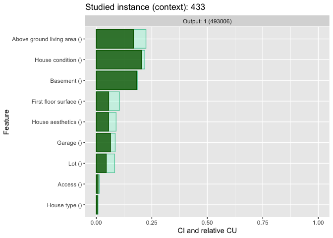<!-- -->

Then explain further some intermediate concepts:

``` r
# House condition
print(Ames.voc_ciu$ggplot.col.ciu(instance, ind.inputs = Ames.voc$`House condition`, 
                                  target.concept = "House condition", plot.mode = "overlap"))
```

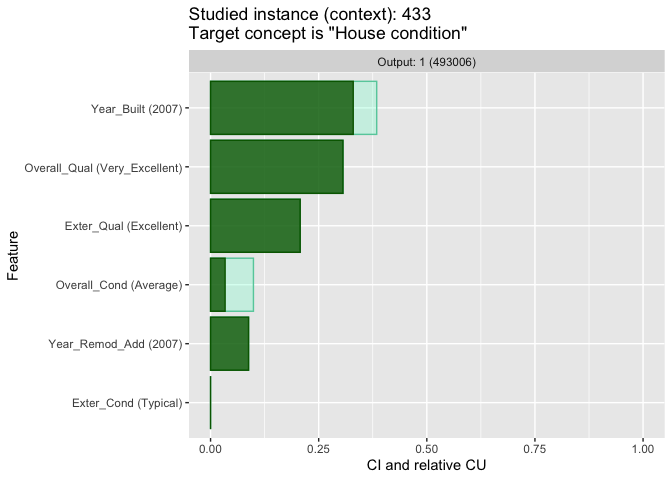<!-- -->

``` r
# Basement
print(Ames.voc_ciu$ggplot.col.ciu(instance, ind.inputs = Ames.voc$Basement, 
                                  target.concept = "Basement", plot.mode = "overlap"))
```

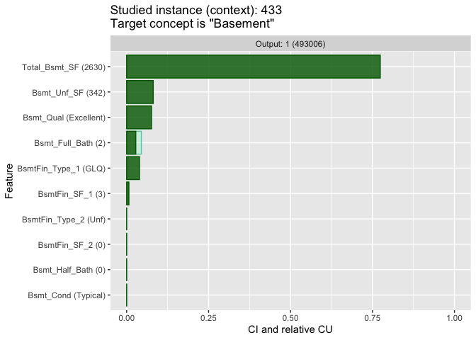<!-- -->

``` r
# Garage
print(Ames.voc_ciu$ggplot.col.ciu(instance, ind.inputs = Ames.voc$Garage, 
                                  target.concept = "Garage", plot.mode = "overlap"))
```

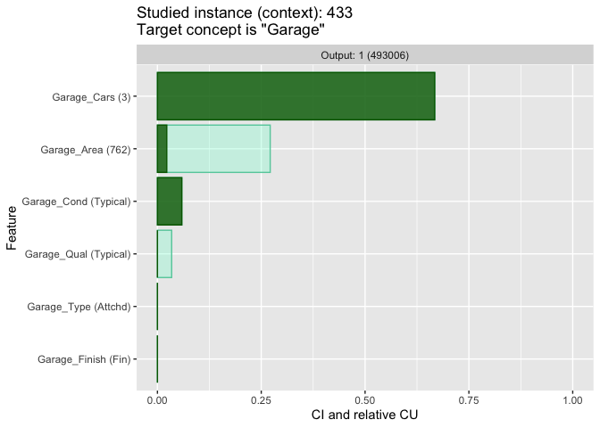<!-- -->

This vocabulary is just an example of what kind of concepts a human
typically deals with. Vocabularies can be built freely (or learned, if
possible) and used freely, even so that different vocabularies can be
used with different users.

# Installation

`ciu` is available from CRAN at
<https://cran.r-project.org/web/packages/ciu/index.html> and can be
installed using the standard `install.packages("ciu")` command.

However, in order to use the latest developments, `ciu` can be installed
directly from Github with the commands

``` r
# install.packages('devtools') # Uncomment if devtools wasn't installed already
devtools::install_github('KaryFramling/ciu')
```

**Remark**: If you get an error about inconsistency in Help file
database, then restart R. This seems to happen if first removing `ciu`
and then doing the install straight after. Apparently the un-install
temporarily messes up the help database and this is not specific to
`ciu`.

# Miscellaneous

The examples and code snippets shown here only show the main
capabilities of CIU and this implementation. Here’s a short list of
miscellaneous other features of “good to know” information.

## Various examples and test cases

The file [`TestCases.R`](TestCases.R) contains functions for running and
testing CIU with numerous functions and data sets (Iris, Boston, Heart
Disease, UCI Cars, Diamonds, Titanic, Adult, Ames housing, etc.) and
machine learning models (lda, Random Forest, GBM).

## Support for different AI/ML models

For the moment, any `caret` model should work (and most of them have
been tested). Any `mlr3`model should also work but only
`classif.rpart`has been tested. The `MASS:lda` and `stats::lm` models
are also supported. Other models might work directly also, the default
behaviour is to call `pred <- predict(model,inputs)` and retrieve result
from `pred$posterior`.

For any other models, the prediction function to be use can be given as
value of the `predict.function` argument of `ciu.new` method. For
instance, for `mlr3` a function
`predf.ciu <- function(m, newdata) { m$predict_newdata(newdata)$prob }`
is sufficient.

Additionally, any object that implements the `CIU.BlackBox` interface
with an `eval` function is automatically supported. The template for
creating such a class looks as follows and examples are provided in the
package’s documentation (do `?ciu.blackbox.new`).

``` r
ciu.blackbox.new <- function() {
  m <- list(eval = function(inputs) { NULL })
  class(m) <- c("CIU.BlackBox", class(m))
  return(m)
}
```

## Using old R “plot” functions

Some plotting functions are implemented that use R’s plain graphics:

``` r
ciu$barplot.ciu(new_passenger, ind.output = 2, sort = "CI")
```

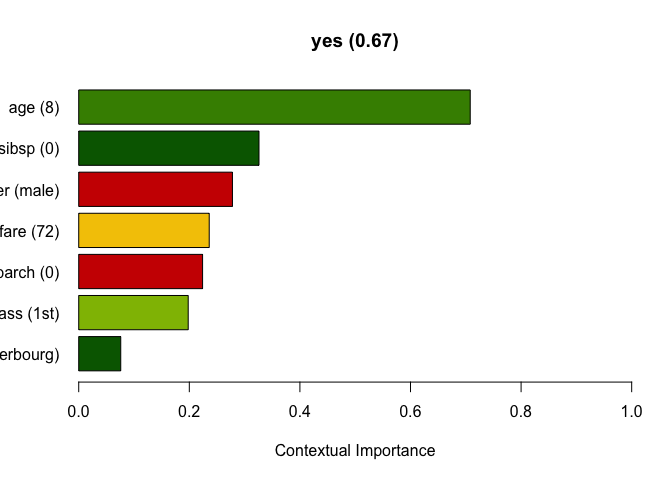<!-- -->

There is also a method called pie.ciu that visualizes CIU using a pie
chart, produced just by replacing `ciu@barplot.ciu` with `ciu@pie.ciu`.

``` r
ciu$pie.ciu(new_passenger, ind.output = 2)
```

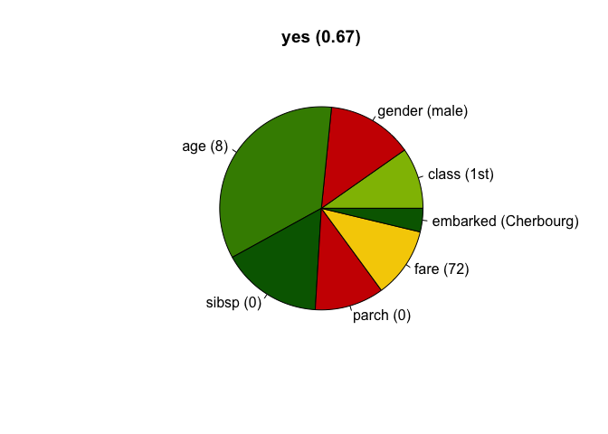<!-- -->

However, these functions can be considered deprecated and will
presumably not be developed further.

# Related resources

A Python version that (attempts to) provide similar functionality as
this R package is available at <https://github.com/KaryFramling/py-ciu>.
An older version is available at <https://github.com/TimKam/py-ciu> but
it is not maintained nor updated anymore.

There are also two implementations of CIU for explaining images:

- R: <https://github.com/KaryFramling/ciu.image>

- Python: <https://github.com/KaryFramling/py.ciu.image>

Image explanation packages can be considered to be at proof-of-concept
level (Nov. 2022). Future work on image explanation will presumably
focus on the Python version, due to the extensive use of deep neural
networks that tend to be implemented mainly for Python.

# References

The use of this package is described in *FRÄMLING, Kary. Contextual
Importance and Utility in R: the ‘ciu’ Package. In: Proceedings of 1st
Workshop on Explainable Agency in Artificial Intelligence, at 35th AAAI
Conference on Artificial Intelligence. Virtual, Online. February 8-9,
2021. pp. 110-114.*, accessible at
<http://www.cs.hut.fi/~framling/Publications/CIU_XAI_WS_AAAI2021.pdf>.

The first publication on CIU was in the ICANN conference in Paris in
1995: *FRÄMLING, Kary, GRAILLOT, Didier. Extracting Explanations from
Neural Networks. ICANN’95 proceedings, Vol. 1, Paris, France, 9-13
October, 1995. Paris: EC2 & Cie, 1995. pp. 163-168.*, accessible at
[http://www.cs.hut.fi/u/framling/Publications/FramlingIcann95.pdf](http://www.cs.hut.fi/~framling/Publications/CIU_XAI_WS_AAAI2021.pdf).

The second publication, and last before “hibernation” of CIU research,
is *FRÄMLING, Kary. Explaining Results of Neural Networks by Contextual
Importance and Utility. Proceedings of the AISB’96 conference, 1-2 April
1996. Brighton, UK, 1996.*, accessible at
[http://www.cs.hut.fi/u/framling/Publications/FramlingAisb96.pdf](http://www.cs.hut.fi/~framling/Publications/CIU_XAI_WS_AAAI2021.pdf).

# Author

[Kary Främling](http://github.com/KaryFramling)
