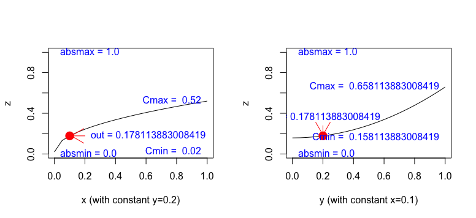
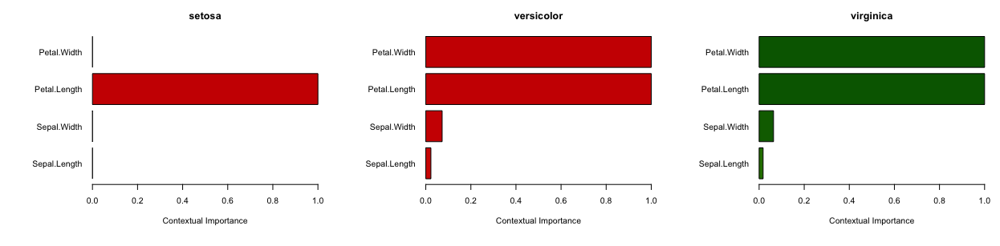
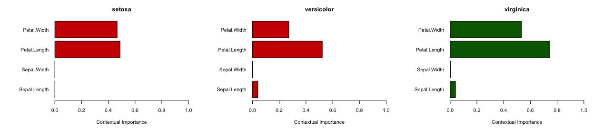
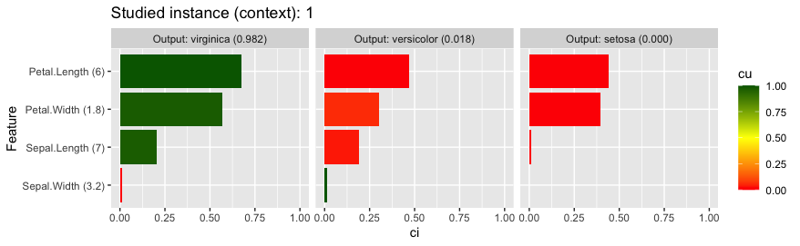
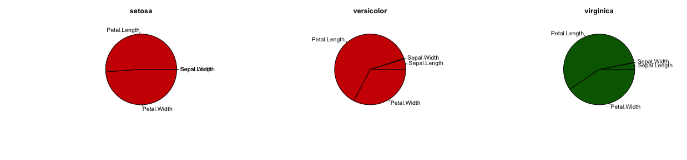
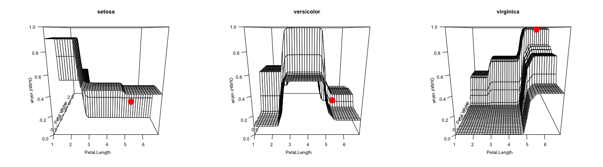
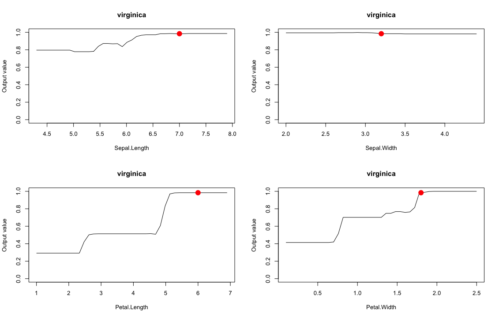

# ciu
R implementation of Contextual Importance and Utility for Explainable AI

# Background

This is an R implementation of the Contextual Importance and Utility (CIU) concepts for Explainable AI (XAI). CIU was developed by Kary Främling in his PhD thesis *Learning and Explaining Preferences with Neural Networks for Multiple Criteria Decision Making*, (written in French, title *Modélisation et apprentissage des préférences par réseaux de neurones pour l'aide à la décision multicritère*), available online for instance here: https://tel.archives-ouvertes.fr/tel-00825854/document. It was originally implemented in Matlab. A new Matlab implementation can be found at https://github.com/shulemsi/CIU. A Python implementation can be found at https://github.com/TimKam/py-ciu. However, these three implementations have been developed quite independently from each other so their functionality and features may differ (and probably do differ). 

Documentation generated by [devtools::build_site is available here](docs/index.html).

# What is CIU?

According to current (2020) XAI vocabulary, CIU is a model-agnostic method for producing outcome explanations of results of any "black-box" model that takes a set of input variable values, does some processing and produces a set of output variable values. 

CIU does not create any "interpretable" copy of the black box, not even a locally linear approximation or similar. It is based on directly estimating two elements of explanation by observing the behaviour of the black-box model:  

* **Contextual Importance (CI)** is a measure of how much an output can change as a function of changes of one (or several) inputs.
* **Contextual Utility (CU)** indicates how favorable the current value of one (or several) inputs is for a high output value. 

The following figure illustrates the principle, when we want to explain why the output value ``z=0.178`` (i.e. not so good) for the input values ``(x,y)=(0.1,0.2)``. The non-linear "black-box" function is ``z = (x^0.5 + y^2)/2``. 



``CI = (Cmax - Cmin)/(absmax - absmin)``

``CU = (out - Cmin)/(Cmax - Cmin)``

For the illustration in the figure, ``CI = 0.5`` for both inputs, whereas ``CU = 0.32`` for ``x`` and ``CU = 0.04`` for ``y``. More formal and detailed descriptions can be found in articles on CIU. 

# Installation

In the future, ciu will presumably be available from CRAN. Meanwhile, it can be installed directly from Github with the command 

```
# install.packages('devtools') # Uncomment if devtools wasn't installed already
devtools::install_github('KaryFramling/ciu')
```
**Remark**: If you get an error about inconsistency in Help file database, then restart R. This seems to happen if first removing `ciu` and then doing the install straight after. Apparently the un-install temporarily messes up the help database and this is not specific to `ciu`.  

# Running

The file [``TestCases.R``](TestCases.R) contains functions for running and testing CIU with various data sets (Iris, Boston, Heart Disease, UCI Cars, Diamonds) and machine learning models (lda, Random Forest, GBM). What is shown in the rest of this README.md file is mainly for giving a quick introduction to CIU and the use of the `ciu`package without needing to install it first.

We use the Iris data set here for simplicity. Iris is a classification task. The use of CIU for a regression task is shown with the [Boston Housing Dataset and Gradient Boosting (gbm) model here](manual_docs/BostonCIU.md). 

To begin with, we will start by training an lda model on the Iris data set. 

``` r
library(MASS)
iris_train <- iris[, 1:4]
iris_lab <- iris[[5]][]
model <- lda(iris_train, iris_lab)
```

Then we test with a particular Iris flower instance and set up the CIU explainer. This Iris will clearly be a Virginica if the model learns correctly. What we want to know is why it is a Virginica.  

``` r
# The hypothetical Iris that we have been using in CIU tests.
iris_test <- iris_train[1,] # Just to initialize and get columns etc right
iris_test[1,]<-c(7, 3.2, 6, 1.8)
ciu <- ciu.new(model, Species~., iris, output.names=levels(iris$Species))
ciu$explain(iris_test, ind.inputs.to.explain=c(1))
# Displays something like:
#                     CI           CU         Cmin         Cmax
#setosa     1.833523e-33 6.581821e-05 1.180608e-50 1.833523e-33
#versicolor 2.316049e-02 6.043223e-02 2.158111e-07 2.316071e-02
#virginica  2.316049e-02 9.395678e-01 9.768393e-01 9.999998e-01
```

CIU values are just the "raw material" for producing actual explanations, which can be visual, textual, sounds or whatever means of presentation is the most appropriate to the user and the context. A bar plot of the same kind as what is often used for LIME and SHAP, for instance, is produced by the following method call. 

``` r
ciu$barplot.ciu(iris_test, ind.output=3)
```

When doing a barplot for all Iris classes with lda model, it looks like below. 


The code for producing that plot is the following: 

``` r
# Do barplot for all three classes in same Figure
par(mfrow=c(1,3))
for ( iris.ind in 1:length(levels(iris$Species)) ) {
    ciu$barplot.ciu(iris_test, ind.output=iris.ind)
}
par(mfrow=c(1,1))
```

A major difference in the plot above compared to those that are usually used with LIME, for instance, is that CIU has two dimensions (**importance** and **utility**) rather than only speaking about *importance* as most (all?) other methods. The length of the bar corresponds to the Contextual Importance (CI) value, while the color changes depending on the Contextual Utility (CU). A "low" CU (<0.5 by default) signifies that the value is defavorable for the output and gives a red bar. A "high" CU (>=0.5 by default) signifies that the value is favorable for the output and gives a green bar. The more (de/)favorable the value, the darker the colour. *lda* tends to produce very sharp class limits, so the color nuances are not well visible in this case. 

Next, we will do the same using a Random Forest model. 

``` r
# Then same with Random Forest
library(caret)
model <- train(iris_train, iris_lab, method = 'rf')
ciu <- ciu.new(model, Species~., iris, output.names=levels(iris$Species))
ciu$explain(iris_test, ind.inputs.to.explain=c(1))
#           CI    CU Cmin  Cmax 
#setosa     0     0  0     0    
#versicolor 0.034 0  0.002 0.036
#virginica  0.034 1  0.964 0.998
ciu$barplot.ciu(iris_test, ind.output=3)

```
When doing a barplot for all Iris classes with Random Forest model, it looks like below. 


The code for producing that plot is the following: 

``` r
# Do barplot for all three classes in same Figure
par(mfrow=c(1,3))
for ( iris.ind in 1:length(levels(iris$Species)) ) {
  ciu$barplot.ciu(iris_test, ind.output=iris.ind)
}
par(mfrow=c(1,1))
```

The same might be more practical to do using ggplot version: 

``` r
ciu$ggplot.col.ciu(iris_test)
```

The ggplot version looks like below. 



There is also a method called pie.ciu that visualizes CIU using a pie chart, that looks like the following, produced just by replacing ``ciu@barplot.ciu`` with ``ciu@pie.ciu``. 


The following figure shows how the outputs of all three Iris classes change as a function of "Petal Size" with Random Forest classifier. This was produced by calling ``ciu$plot.ciu.3D(iris_test, c(3,4), ind.output=1)`` for all three `ind.output` values.



The following figure shows how the output for Virginica changes as a function of the four different inputs with Random Forest classifier. This was produced by calling ``ciu$plot.ciu(iris_test, ind.input=3, ind.output=3)`` for all three `ind.output` values.



Figures such as these make it possible to see where CI and CU come from. CI expresses how much a result/output can change as a function of one or more inputs relatively to the whole output range. CU expresses if the current value is favorable for a high value or not.

# Support for different AI/ML models

For the moment, any ``caret`` model should work (and most of them have been tested). The ``MASS:lda`` and ``stats::lm`` are also supported. Other models might work directly also, the default behaviour is to call ``pred <- predict(model,inputs)`` and retrieve result from ``pred$posterior``. 

For any other models, the prediction function to be use can be given as value of the ``predict.function`` argument of ``ciu.new`` method. 

Additionally, any object that implements the ``CIU.BlackBox`` interface with an ``eval`` function is automatically supported. The template for creating such a class looks as follows and examples are provided in the package's documentation (do ``?ciu.blackbox.new``).

``` r
ciu.blackbox.new <- function() {
  m <- list(eval = function(inputs) { NULL })
  class(m) <- c("CIU.BlackBox", class(m))
  return(m)
}
```

# Author

[Kary Främling](http://github.com/KaryFramling)

# References
The first publication on CIU was in the ICANN conference in Paris in 1995: *FRÄMLING, Kary, GRAILLOT, Didier. Extracting Explanations from Neural Networks. ICANN'95 proceedings, Vol. 1, Paris, France, 9-13 October, 1995. Paris: EC2 & Cie, 1995. pp. 163-168.*, accessible at http://www.cs.hut.fi/u/framling/Publications/FramlingIcann95.pdf.

The second publication, and last before "hibernation" of CIU research, is *FRÄMLING, Kary. Explaining Results of Neural Networks by Contextual Importance and Utility. Proceedings of the AISB'96 conference, 1-2 April 1996. Brighton, UK, 1996.*, accessible at http://www.cs.hut.fi/u/framling/Publications/FramlingAisb96.pdf.

The first publication after "hibernation" is *ANJOMSHOAE, Sule, FRÄMLING, Kary, NAJJAR, Amro. Explanations of black-box model predictions by contextual importance and utility. In: Lecture Notes in Computer Science, Vol. 11763 LNAI; Revised Selected Papers of Explainable, Transparent Autonomous Agents and Multi-Agent Systems - 1st International Workshop, EXTRAAMAS 2019, Montreal, Canada, May 13-14, 2019. pp. 95-109.* https://www.researchgate.net/publication/333310978_Explanations_of_Black-Box_Model_Predictions_by_Contextual_Importance_and_Utility.

Several new publications are on the way. It is quite interesting that this model-agnostic, post-hoc XAI principle from 25 years back has passed quite un-noticed despite the rise of the XAI community. 


