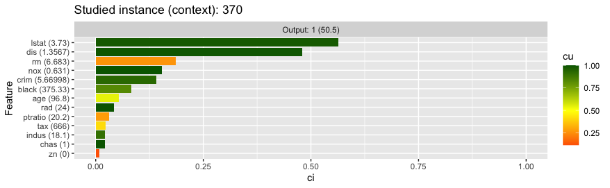
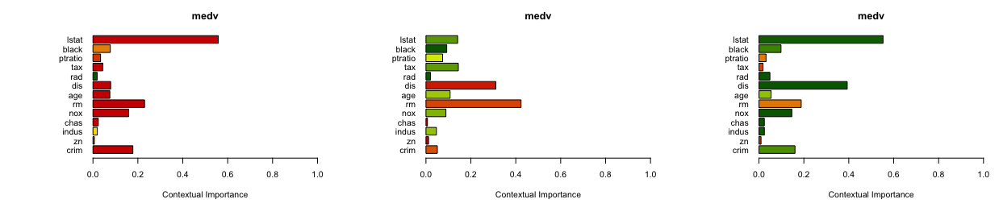
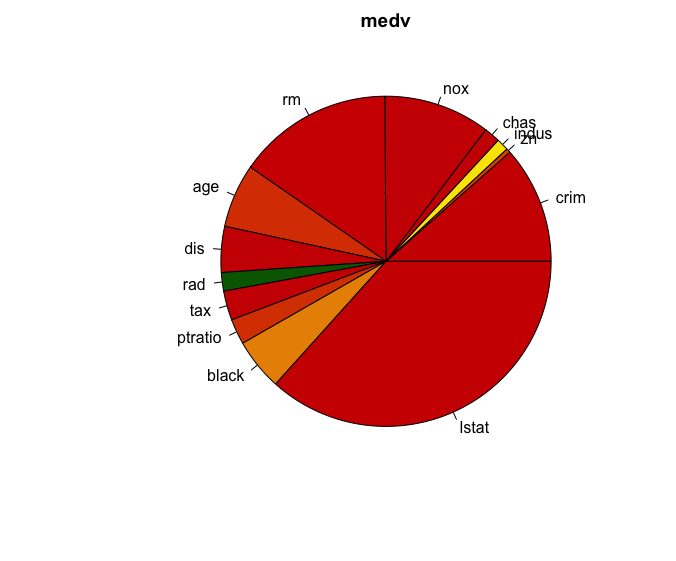
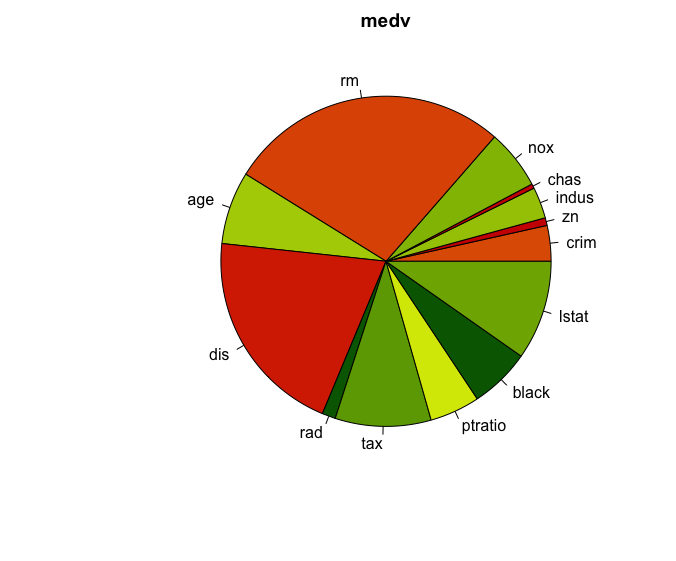
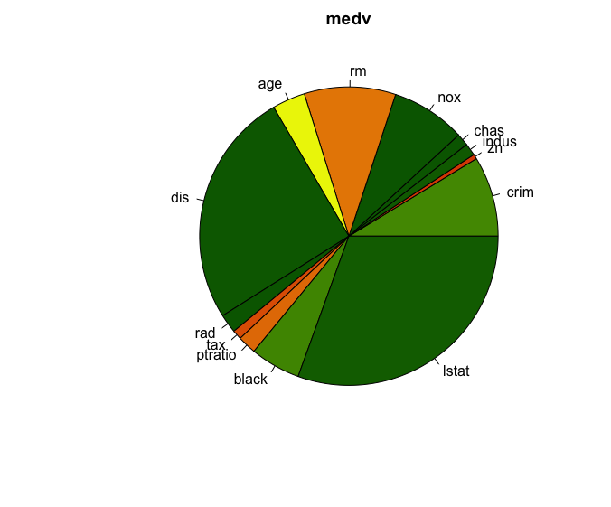

# CIU with Boston Housing Dataset

The Boston Housing Dataset is a classical benchmark set used in Data Analysis and Machine learning, available in the MASS library. 

A gradient boosting model will be used here for learning the mapping from the 13 input variables to the Median value of owner-occupied homes in $1000's. This is a regression task (not a classification task), which means that the best explanation approach might be different. However, for CIU it doesn't really matter whether it is a classification or a regression task.

gbm is not (yet) supported directly by ``ciu``, so we will provide the ``predict``function to use as an argument to ``ciu.new``. This is a generic way for providing support for "any" regression/classification model. 

```r
require(MASS) # Just in case Boston is not already available
require(gbm)

# We don't care about train/test set in this case because it's not about evaluating training performance.
Boston.boost=gbm(medv ~ . ,data = Boston, distribution = "gaussian", n.trees=10000,
                 shrinkage = 0.01, interaction.depth = 4)
```
Gradient Boosting (gbm) is not yet supported by ``ciu`` implementation, so we need to tell ``ciu`` explicitly what it looks like. 

```r
predict.function <- function(model, inputs) { predict(model,inputs,n.trees=10000) }
```
We initialize and create CIU object and get CI and CU for row 370, which has a high median value (50).

```r
n.in <- ncol(Boston) - 1
ciu <- ciu.new(Boston.boost, medv~., Boston, predict.function=predict.function)
inst.ind <- 370
ciu$explain(Boston[inst.ind,1:n.in], ind.inputs.to.explain=c(1))
# Gives CI and CU for the first input variable (crim) and looks something like this: 
#         CI        CU     cmin     cmax   outval
#1 0.1630439 0.8111716 44.55798 51.89496 50.50953
```
Then we display bar, ggplot.col and pie charts with the following. Example of ggplot version is shown below. 

```r
ciu$ggplot.col.ciu(Boston[inst.ind,1:n.in])
ciu$barplot.ciu(Boston[inst.ind,1:n.in])
ciu$pie.ciu(Boston[inst.ind,1:n.in])
```


# Alternative way for supporting "any" model
The ``CIU.BlackBox`` class is supported automatically by ``ciu``. It essentially means that the model class needs to inherit ``CIU.BlackBox`` and implement an ``eval(inputs)``method. 

The following code shows how this can be done for Gradient Boosting. The same principle is applicable for any model. This approach is more flexible than providing a ``predict.function`` argument to ``ciu.new()`` because it is possible to associate information with the object. In this example, the ``n.trees``parameter is stored as an object instance value but it is possible to implement any required processing with this approach. 

```r
# CIU with Gradient Boosting, CIU.BlackBox wrapper
gbm.bb.new <- function(gbm, n.trees=1) {
  o.gbm <- gbm
  o.n.trees <- n.trees
  pub <- list(eval = function(inputs) { predict(o.gbm,inputs,n.trees=o.n.trees) })
  class(pub) <- c("CIU.BlackBox",class(pub))
  return(pub)
}
gbm.bb <- gbm.bb.new(Boston.boost, 10000)
ciu.gbm.bb <- ciu.new(gbm.bb, medv~., Boston)
inst.ind <- 370
ciu.gbm.bb$barplot.ciu(Boston[inst.ind,1:n.in], sort="CI")
```

# Example barplots by CIU

The following figure shows the barplot of three instances: #406 (medv=5, lowest), #6 (medv=28.7, average), #370 (medv=50, highest). 



The code for producing this image is the following: 

```r
par(mfrow=c(1,3))
ciu.gbm.bb$barplot.ciu(Boston[406,1:n.in])
ciu.gbm.bb$barplot.ciu(Boston[6,1:n.in])
ciu.gbm.bb$barplot.ciu(Boston[370,1:n.in])
par(mfrow=c(1,1))
```

Same as pie charts (using pie.CI.CU instead of barplot.CI.CU): 





# Author

[Kary Främling](http://github.com/KaryFramling)


